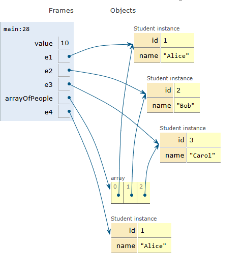

# Module 04 Team Activity - Equality, Hashing, and Collections Framework

For this activity, we are going look at the purpose of .equal and .hashCode methods in Java. We will also look at the Collections Framework in Java, specifically in the context of collections that need .equals and .hashCode methods for them to work effectively. 

Additionally, to further your understanding of Java, we will cover in more detail on how to read and write files. 

## Grading
Grades for team activities will be based on attendance and notes. You must attend, and as a team you need to generate notes that we can confirm your work. Ideally, you upload the notes as a PDF to the team meeting after you build them out. 

> [!TIP] 
> Good notes become a study guide for you and your team! Make sure they include everything you need to help better understand the weekly material. 

### ⭐ Working in Teams ⭐
When working in teams, remember do not let one person do all the work. Make sure to work together, and ask questions. It is also better if different people program, and you all take turns programming for various team assignments.

## Learning Objectives
This team activity is designed to help you understand the following concepts:
* How to properly implement .equals and .hashCode methods in Java
* Describe the Set and Map interfaces in Java
* How to use the HashSet and HashMap  in Java, along how they work with Steams.
* Be able to read and write to a  File in using Java

## Equality in Java

To better understand equality in java, it is worth discussing the difference between a primitive and an object. 

* Primitive types are the basic data types in Java, such as int, char, double, and boolean. Another way to look at them is they are types that can represented by a single number in memory. 
* Objects are complex data types that are made up of multiple primitive types or objects. In memory, they are often represented by a reference to a memory location. 

Let's take the following java code as an example:

```java
class Person {
  private String name;
  public Person(String theName) {
    this.name = theName;
  }
}

public class Student extends Person {
  private int id;
  public Student(String theName, int id) {
    super(theName);
    this.id = id;
  }

  public static void main(String[] args) {
    int value = 10;
    Person e1 = new Student("Alice", 1);
    Person e2 = new Student("Bob", 2);
    Person e3 = new Student("Carol", 3);
    Person arrayOfPeople[] = {e1, e2, e3};
    
    Person e4 = new Student("Alice", 1); // same as e1?
    
    System.out.println(e1 == arrayOfPeople[0]); // what is printed here?
    System.out.println(e1 == e4); // what is printed here?
  }
}
```

Using the PythonTutor (which also happens to allow java visualizations, though a bit buggy and limited) you may have used in 5001, we are able to generate the following visualization of the code above:



 
 Where ever there is an arrow, there is actually a memory address. 

 ### 👉🏽 Discussion
 Looking at both the memory diagrams, and the code - what do you think will be printed when the code is run? Why? 


### Implementing .equals and .hashCode in Java

In general, the `==` sign can only truly compare primitives because they compare what is exactly on the stack frame at that moment. For objects, what is on the stack frame is actually the memory address of the object. To overcome that limitation, every Object in java has both a `.equals` and `.hashCode` method. They don't do anything special or different by default, but they can be overridden to provide a more meaningful comparison.

For example, if we wanted a student with the Name and ID to be equal to another student with the same name and ID, we could override the `.equals` method in the Student class. 


:fire: Task: Implement the `.equals` method in the Student class.  Use the two templates provided. [Person.java](Person.java) and [Student.java](Student.java). Notice the main
changed some from the above example, so you can better test your results.  While using `instanceof` is *alright* can you think of how you would do it using
reflection? 
